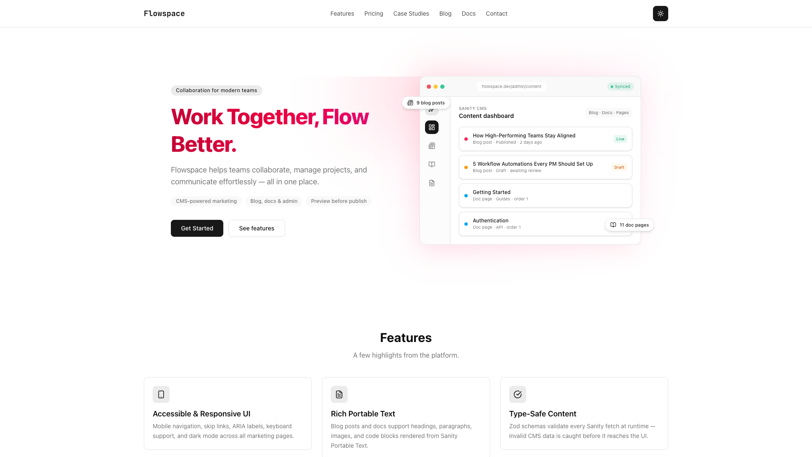
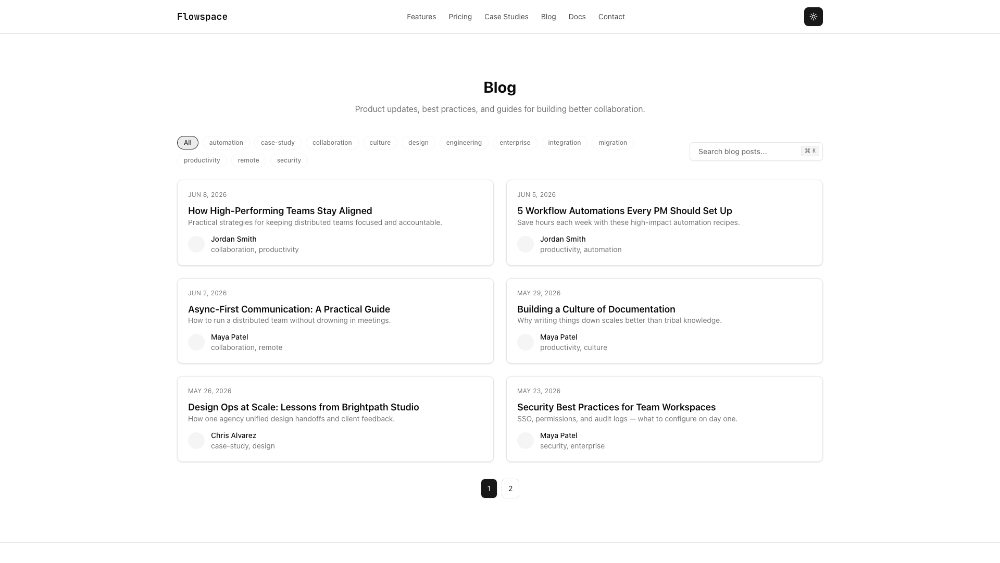
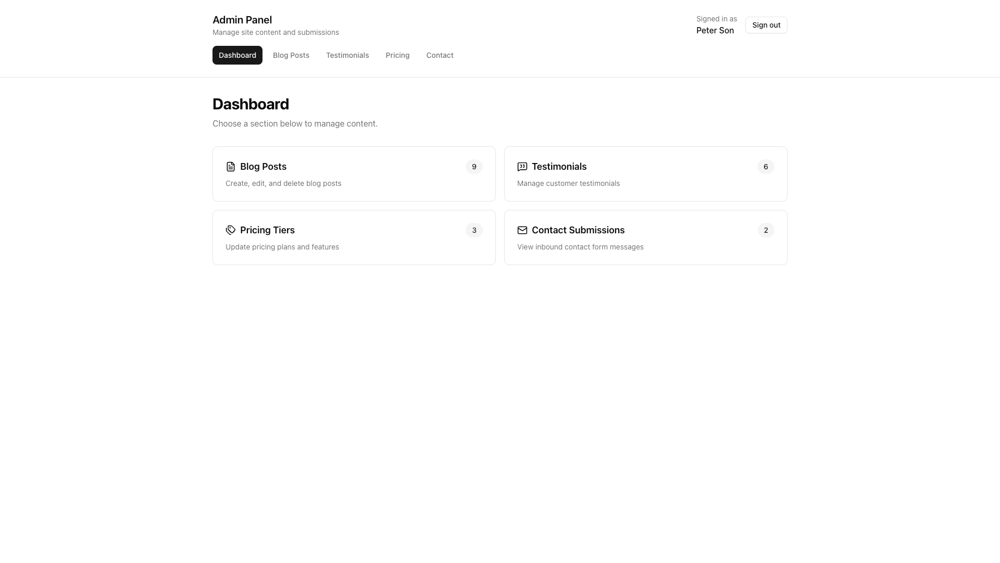
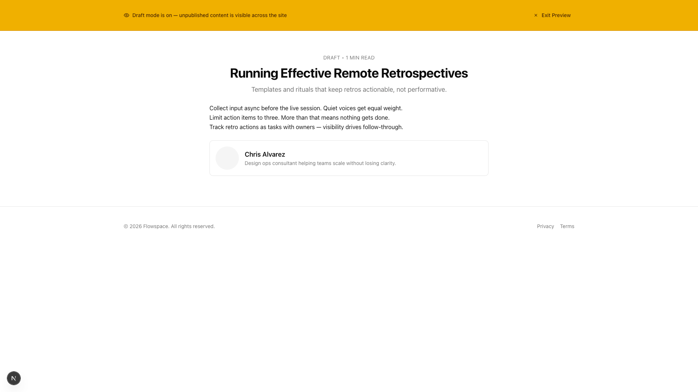

# Flowspace

[](https://github.com/YOUR_GITHUB_USERNAME/demo-project-collaboration-next-sanity/actions/workflows/ci.yml)

A CMS-driven marketing and collaboration platform built with **Next.js 15**, **Sanity**, and **NextAuth**. Portfolio demo for Upwork — showcases headless CMS integration, preview mode, ISR caching, admin CRUD, and type-safe content pipelines.

## Live demo

> Replace the placeholder URLs below after deploying to Vercel and Sanity Studio.

| Resource | URL |
|----------|-----|
| **Live site** | `https://flowspacestudio.vercel.app` |
| **Sanity Studio** | [https://flowspacestudio.sanity.studio](https://flowspacestudio.sanity.studio) |
| **Walkthrough** *(optional)* | `https://www.loom.com/share/your-video-id` |

### Screenshots

Add captures to [`docs/screenshots/`](docs/screenshots/) after deploy, then uncomment the images below.

<!--




-->

**Quick deploy:** Push to Vercel → set env vars from [`.env.example`](.env.example) → run `npm run seed:sanity:fresh` → update the links above.

## Portfolio case study

**Problem:** Teams need a marketing site where non-developers can publish pages, blog posts, and docs — with draft preview, fast performance, and an admin layer for operational content.

**What I built:**

- Headless CMS integration with Sanity (schemas, GROQ queries, Zod validation)
- Marketing pages, blog, docs hub, and case study detail routes — all CMS-driven
- Draft preview mode with visual indicator and secure exit route
- ISR caching with cache tags and on-demand revalidation via Sanity webhook
- GitHub OAuth admin panel with CRUD for blog posts, testimonials, pricing, and contact submissions
- Per-post Open Graph images from Sanity assets
- Accessible UI (skip links, semantic HTML, form validation)
- Seed script with `--fresh` flag for demo-ready content
- Jest unit tests + Playwright e2e (home, blog, contact, docs)
- GitHub Actions CI: lint → typecheck → test → build → e2e

**Stack:** Next.js 15 · React 19 · Sanity · Zod · NextAuth · Tailwind CSS · Playwright

**Caching pipeline:** Sanity content is fetched via GROQ, validated with Zod schemas, then served through `cachedSanityFetch` (Next.js `unstable_cache` + ISR tags). Publish events trigger `/api/revalidate` to bust stale pages without a full redeploy.

See [SANITY_SETUP.md](SANITY_SETUP.md) for CMS credentials, Studio deploy, and webhook configuration.

## Features

- Marketing pages powered by Sanity (home, features, pricing, about, case studies, contact)
- Blog with search, tags, pagination, and per-post OG images
- Documentation hub with sidebar navigation and search
- Case study listing and detail pages with outcome metrics
- Dynamic SEO (sitemap, robots, metadata helpers)
- GitHub OAuth admin panel with CRUD for blog posts, testimonials, and pricing
- Preview mode for draft Sanity content
- ISR caching, optimized Sanity images, and accessibility improvements
- Jest unit tests and Playwright e2e tests

## Getting started

### 1. Install dependencies

```bash
npm install
```

### 2. Set up environment variables

Copy [`.env.example`](.env.example) to `.env.local` and fill in the required values. See [SANITY_SETUP.md](SANITY_SETUP.md) for Sanity project setup.

### 3. Prepare Husky (optional)

```bash
npm run prepare
```

### 4. Seed demo content (optional)

```bash
npm run seed:sanity:fresh
```

### 5. Run the dev server

```bash
npm run dev
```

Open [http://localhost:3000](http://localhost:3000).

## Scripts

| Script | Description |
|--------|-------------|
| `npm run dev` | Start development server |
| `npm run build` | Production build |
| `npm run start` | Start production server |
| `npm test` | Run unit tests |
| `npm run e2e` | Run Playwright e2e tests |
| `npm run seed:sanity` | Seed Sanity with demo content (skip existing) |
| `npm run seed:sanity:fresh` | Clear and re-seed all demo content |
| `npm run lint` | Lint the codebase |
| `npm run typecheck` | TypeScript type check |

## Project structure

```bash
.
├── sanity/              # Sanity schema and Studio config
├── scripts/             # Utility scripts (e.g. seed)
├── docs/screenshots/    # Portfolio screenshots (add after deploy)
└── src
    ├── app/             # Next.js App Router pages and API routes
    ├── components/      # React components
    ├── lib/             # Utilities, Sanity client, SEO helpers
    └── styles/          # Global styles
```

## License

See [LICENSE.md](LICENSE.md).
