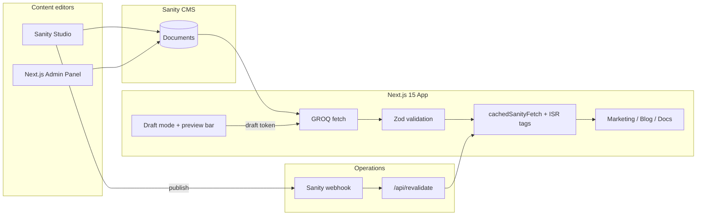

# Flowspace

[](https://github.com/sonpeterweb/demo-project-collaboration-next-sanity/actions/workflows/ci.yml)

**CMS-driven marketing platform built with Next.js + Sanity** — demonstrates headless CMS, preview, caching, admin CRUD, and SEO. Portfolio demo for Upwork.

## Live demo

| Resource | URL |
|----------|-----|
| **Live site** | [https://flowspacestudio.vercel.app](https://flowspacestudio.vercel.app) |
| **Sanity Studio** | [https://flowspacestudio.sanity.studio](https://flowspacestudio.sanity.studio) |
| **Preview mode** | [One-click demo URL](#preview-mode-demo) (requires `SANITY_PREVIEW_SECRET`) |

### Screenshots


**Quick deploy:** Push to Vercel → set env vars from [`.env.example`](.env.example) → run `npm run seed:sanity:fresh` → update the links above.

---

## What's real vs. demo content

| Real (implemented) | Demo / illustrative |
|--------------------|---------------------|
| Sanity CMS schemas, Studio, GROQ queries, Zod validation | Product copy, case studies, testimonials, pricing tiers |
| Draft preview mode with secure secret + middleware guard | Docs references to `api.flowspace.dev` and SSO workflows |
| ISR caching + on-demand revalidation webhook | Enterprise feature lists in seeded pricing |
| GitHub OAuth admin CRUD (blog, testimonials, pricing, contact) | Fictional customer names and outcome metrics |
| Blog search, docs hub, contact form → Sanity storage | “Collaboration platform” branding as sample vertical |
| Jest unit tests + Playwright e2e + GitHub Actions CI | — |

This is a **marketing-site portfolio piece**, not a collaboration SaaS product. It shows how I'd build a CMS-driven site for a real client.

---

## Lighthouse scores

Measured on [flowspacestudio.vercel.app](https://flowspacestudio.vercel.app) (June 2026, mobile simulation):

| Category | Score |
|----------|-------|
| Performance | **95** |
| Accessibility | **92** |
| Best Practices | **100** |
| SEO | **100** |

---

## Architecture



**Caching pipeline:** Sanity content is fetched via GROQ, validated with Zod schemas, then served through `cachedSanityFetch` (Next.js `unstable_cache` + ISR tags). Publish events trigger `/api/revalidate` to bust stale pages without a full redeploy.

**Preview pipeline:** `/api/preview?secret=…&slug=…` validates `SANITY_PREVIEW_SECRET`, enables draft mode, sets an auth cookie, and redirects. Middleware blocks draft-mode cookies that weren't issued through the preview route.

---

## Portfolio case study

**Problem:** Teams need a marketing site where non-developers can publish pages, blog posts, and docs — with draft preview, fast performance, and an admin layer for operational content.

**What I built:**

- Headless CMS integration with Sanity (schemas, GROQ queries, Zod validation)
- Marketing pages, blog, docs hub, and case study detail routes — all CMS-driven
- Draft preview mode with secret auth, visual indicator, and secure exit route
- ISR caching with cache tags and on-demand revalidation via Sanity webhook
- GitHub OAuth admin panel with CRUD for blog posts, testimonials, pricing, and contact submissions
- Per-post Open Graph images from Sanity assets
- Accessible UI (skip links, semantic HTML, form validation)
- Seed script with `--fresh` flag for demo-ready content
- Jest unit tests + Playwright e2e (home, blog, contact, docs)
- GitHub Actions CI: lint → typecheck → test → build → e2e

**Stack:** Next.js 15 · React 19 · Sanity · Zod · NextAuth · Tailwind CSS · Playwright

See [SANITY_SETUP.md](SANITY_SETUP.md) for CMS credentials, Studio deploy, webhook, and preview configuration.

---

## Preview mode demo

Set `SANITY_PREVIEW_SECRET` in Vercel (and locally in `.env.local`), then open:

```
https://flowspacestudio.vercel.app/api/preview?secret=YOUR_SECRET&slug=blog/how-high-performing-teams-stay-aligned
```

A yellow preview bar appears on every page until you click **Exit Preview** or visit `/api/exit-preview`.

For local dev:

```
http://localhost:3000/api/preview?secret=YOUR_SECRET&slug=blog/how-high-performing-teams-stay-aligned
```

Shorthand for blog posts: `?slug=how-high-performing-teams-stay-aligned` (auto-prefixes `blog/`).

---

## Features

- Marketing pages powered by Sanity (home, features, pricing, about, case studies, contact)
- CMS-managed integrations strip on the home page
- Blog with search, tags, pagination, and per-post OG images
- Documentation hub with sidebar navigation and search
- Case study listing and detail pages with outcome metrics
- Dynamic SEO (sitemap, robots, metadata helpers)
- GitHub OAuth admin panel with CRUD for blog posts, testimonials, and pricing
- Secret-protected preview mode for draft Sanity content
- ISR caching, optimized Sanity images, and accessibility improvements
- Jest unit tests and Playwright e2e tests

## Getting started

### 1. Install dependencies

```bash
npm install
```

### 2. Set up environment variables

Copy [`.env.example`](.env.example) to `.env.local` and fill in the required values. See [SANITY_SETUP.md](SANITY_SETUP.md) for Sanity project setup.

### 3. Prepare Husky (optional)

```bash
npm run prepare
```

### 4. Seed demo content (optional)

```bash
npm run seed:sanity:fresh
```

### 5. Run the dev server

```bash
npm run dev
```

Open [http://localhost:3000](http://localhost:3000).

## Scripts

| Script | Description |
|--------|-------------|
| `npm run dev` | Start development server |
| `npm run build` | Production build |
| `npm run start` | Start production server |
| `npm test` | Run unit tests |
| `npm run e2e` | Run Playwright e2e tests |
| `npm run seed:sanity` | Seed Sanity with demo content (skip existing) |
| `npm run seed:sanity:fresh` | Clear and re-seed all demo content |
| `npm run lint` | Lint the codebase |
| `npm run typecheck` | TypeScript type check |

## Project structure

```bash
.
├── sanity/              # Sanity schema and Studio config
├── scripts/             # Utility scripts (e.g. seed)
├── docs/screenshots/    # Portfolio screenshots
└── src
    ├── app/             # Next.js App Router pages and API routes
    ├── components/      # React components
    ├── lib/             # Utilities, Sanity client, SEO helpers
    └── styles/          # Global styles
```

## License

See [LICENSE.md](LICENSE.md).
